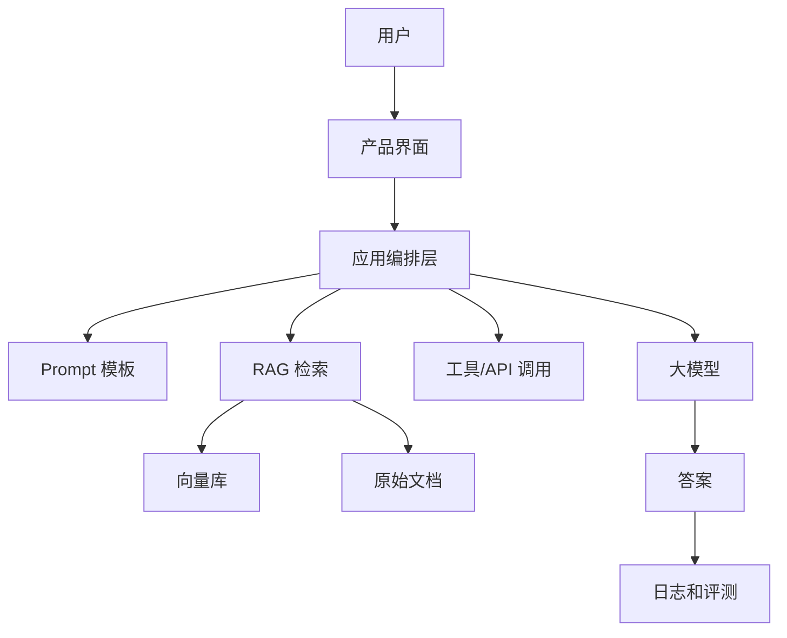

# 大模型应用基础

## 1. 大模型应用到底是什么

大模型应用不是“把 ChatGPT 接进产品”这么简单。一个成熟的大模型应用通常包含：


- 用户输入层：网页、App、企业微信、飞书、命令行、客服系统。
- 业务编排层：决定调用哪个模型、哪些工具、哪些知识库。
- 模型层：通用大模型、Embedding 模型、Rerank 模型、微调模型。
- 数据层：文档、数据库、向量库、日志、用户反馈。
- 评测监控层：质量、成本、延迟、安全、用户满意度。

核心原则：

> 大模型负责不确定的语言理解和生成，传统程序负责确定的规则、权限、数据和流程。

## 2. 常见能力边界

大模型擅长：

- 总结、改写、翻译、分类。
- 信息抽取和结构化。
- 写作、创意、代码辅助。
- 根据上下文回答问题。
- 多步骤推理和方案生成。

大模型不擅长：

- 保证事实永远正确。
- 自动知道你的私有数据。
- 精确执行权限控制。
- 长期记住每个用户的所有信息。
- 替代数据库、搜索引擎、规则引擎。

## 3. Token、上下文和成本

Token 可以粗略理解为模型读写文本的最小单位。中文通常不是一个字等于一个 token，英文也不是一个单词等于一个 token，但可以先这样建立感觉：

- 输入越长，成本越高。
- 输出越长，成本越高。
- 上下文越长，延迟通常越高。
- 把无关内容塞进上下文，会降低回答质量。

上下文窗口不是永久记忆。它只是模型本次回答时能看到的材料。

## 4. Temperature 和生成稳定性

- 低 temperature：更稳定，适合分类、抽取、客服、代码。
- 高 temperature：更多样，适合创意、标题、营销文案。

经验值：

- 严肃业务：0-0.3。
- 普通内容生成：0.5-0.8。
- 创意发散：0.8-1.2。

## 5. Embedding 是什么

Embedding 是把文本变成一串数字向量。语义相近的文本，向量距离也更近。

用途：

- 语义搜索。
- 相似问题推荐。
- 文档去重。
- 聚类。
- RAG 检索。

例子：

- “怎么申请退款”
- “我想退钱怎么办”
- “订单能不能退”

这三句话文字不同，但语义接近，Embedding 检索能把它们找在一起。

## 6. RAG 是什么

RAG 是 Retrieval-Augmented Generation，检索增强生成。

流程：

1. 用户提问。
2. 系统从知识库检索相关资料。
3. 把资料和问题一起发给模型。
4. 模型基于资料回答。
5. 返回答案和引用来源。

RAG 解决的问题：

- 模型不知道你的私有资料。
- 模型训练知识过时。
- 回答需要可追溯来源。

## 7. 微调是什么

微调是用一批高质量样本，让模型更适应某类任务或风格。

它更适合改变：

- 输出风格。
- 固定格式。
- 任务习惯。
- 分类边界。
- 领域表达方式。

它不适合用来存储频繁变化的知识。知识更新优先用 RAG。

## 8. Agent 是什么

Agent 可以理解为“会自己决定下一步调用什么工具的大模型系统”。

普通问答：

```text
用户 -> 模型 -> 答案
```

Agent：

```text
用户 -> 模型判断 -> 调工具 -> 观察结果 -> 再判断 -> 输出答案
```

适合 Agent 的场景：

- 需要多步操作。
- 需要调用外部 API。
- 需要搜索、计算、写文件、查数据库。
- 步骤会因用户问题不同而变化。

不适合一上来就做 Agent 的场景：

- 需求还没验证。
- 一个普通 RAG 就能解决。
- 权限和安全边界不清楚。

## 9. 典型大模型应用架构



## 10. 初学者最容易踩的坑

- 以为换更大的模型就能解决所有问题。
- 没有评测集，只靠主观感觉调 Prompt。
- RAG 文档切块混乱，导致检索结果不准。
- 把太多无关上下文塞给模型。
- 过早微调。
- 忽略日志、成本、延迟和权限。
