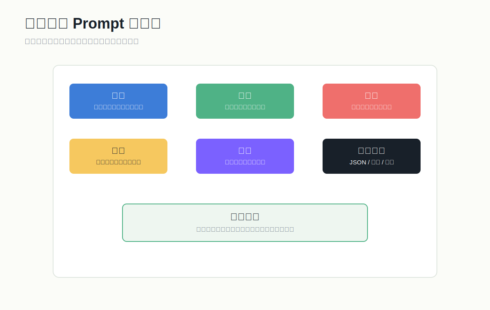

# 提示词工程实战

## 1. 提示词工程的目标

提示词工程不是“写一句神奇咒语”，而是把任务说清楚，让模型稳定输出你要的结果。

一个好 Prompt 应该回答：



- 你是谁：模型扮演什么角色。
- 要做什么：任务目标。
- 基于什么做：背景、数据、资料。
- 怎么做：规则、步骤、判断标准。
- 输出什么：格式、长度、字段。
- 不能做什么：边界和禁止事项。

## 2. 通用 Prompt 结构

```text
角色：
你是一名{领域}专家。

任务：
请根据用户输入完成{具体任务}。

背景：
{业务背景、目标用户、使用场景}

规则：
1. 只基于给定资料回答。
2. 不确定时说“不确定”，不要编造。
3. 输出必须符合指定格式。

输入：
{用户输入或资料}

输出格式：
{JSON / 表格 / Markdown / 列表}
```

## 3. Prompt 优化顺序

1. 先明确成功标准。
2. 给出清楚任务。
3. 给出输出格式。
4. 增加正例。
5. 增加反例。
6. 加入边界规则。
7. 用评测集验证。

不要一开始就把 Prompt 写得很长。越长越不一定越好，关键是信息有效。

## 4. 零样本、少样本、多样本

零样本：

```text
请判断这条用户反馈是“投诉”“咨询”还是“表扬”。
反馈：快递三天没动了。
```

少样本：

```text
请判断用户反馈类型。

示例：
反馈：客服态度很好。
类型：表扬

反馈：怎么修改收货地址？
类型：咨询

反馈：快递三天没动了。
类型：
```

少样本适合：

- 分类边界模糊。
- 输出风格要求高。
- 结构比较固定。

## 5. 结构化输出

如果输出要被程序继续处理，优先要求 JSON。

```text
请从下面文本中提取客户信息，输出 JSON。

字段：
- name: 姓名，没有则为 null
- phone: 手机号，没有则为 null
- intent: 用户意图
- urgency: high / medium / low

文本：
{用户消息}
```

注意：

- 明确字段名。
- 明确缺失值怎么处理。
- 明确枚举值。
- 线上场景要做 JSON 解析失败重试。

## 6. 反幻觉 Prompt

适用于知识库问答：

```text
你必须只基于“参考资料”回答。
如果参考资料不足以回答，请说：“根据现有资料无法确定。”
不要使用外部知识补全。
回答后列出引用资料编号。

参考资料：
{retrieved_context}

问题：
{question}
```

关键点：

- 明确资料边界。
- 允许模型说不知道。
- 要求引用。
- 对无依据结论扣分。

## 7. 分步骤任务

复杂任务可以拆成多个阶段，而不是让模型一次完成所有事。

例子：行业报告生成

1. 先提取资料要点。
2. 再按主题归类。
3. 再生成报告大纲。
4. 再逐章生成。
5. 最后做事实核查和格式检查。

这样比“一次写一篇完整报告”更稳定。

## 8. Prompt 模板管理

建议每个 Prompt 都记录：

- 名称。
- 版本号。
- 适用场景。
- 输入变量。
- 输出格式。
- 测试样例。
- 修改记录。
- 当前已知问题。

文件建议：

```text
prompts/
  customer_service_v1.md
  customer_service_v2.md
  extraction_contract_risk_v1.md
```

## 9. 常见失败和修复

输出太散：

- 增加输出格式。
- 增加示例。
- 限定长度。

模型编造：

- 限定资料来源。
- 要求引用。
- 允许“不知道”。
- 降低 temperature。

格式不稳定：

- 使用 JSON schema 或更严格模板。
- 减少开放式描述。
- 增加解析失败后的自动重试。

回答太啰嗦：

- 限定字数。
- 指定“只输出结论和依据”。
- 给一个简洁示例。

## 10. 三个可直接使用的 Prompt

### 10.1 内容总结

```text
你是一名信息分析师。请总结下面资料。

要求：
1. 先用 3 句话总结核心观点。
2. 再列出 5 个关键事实。
3. 最后列出 3 个可行动建议。
4. 不要添加资料中没有的信息。

资料：
{content}
```

### 10.2 客服回复

```text
你是一名耐心、专业的客服。

任务：
根据用户问题生成客服回复。

规则：
1. 语气友好，但不要过度热情。
2. 如果需要订单信息，请引导用户提供。
3. 不承诺系统无法完成的事情。
4. 输出 80 字以内。

用户问题：
{question}
```

### 10.3 合同风险提取

```text
你是一名合同审查助手。请从合同片段中提取潜在风险。

输出 Markdown 表格，字段：
| 风险等级 | 原文摘录 | 风险说明 | 修改建议 |

规则：
1. 风险等级只能是 高 / 中 / 低。
2. 原文摘录必须来自合同片段。
3. 没有风险则输出“未发现明显风险”。

合同片段：
{contract_text}
```
