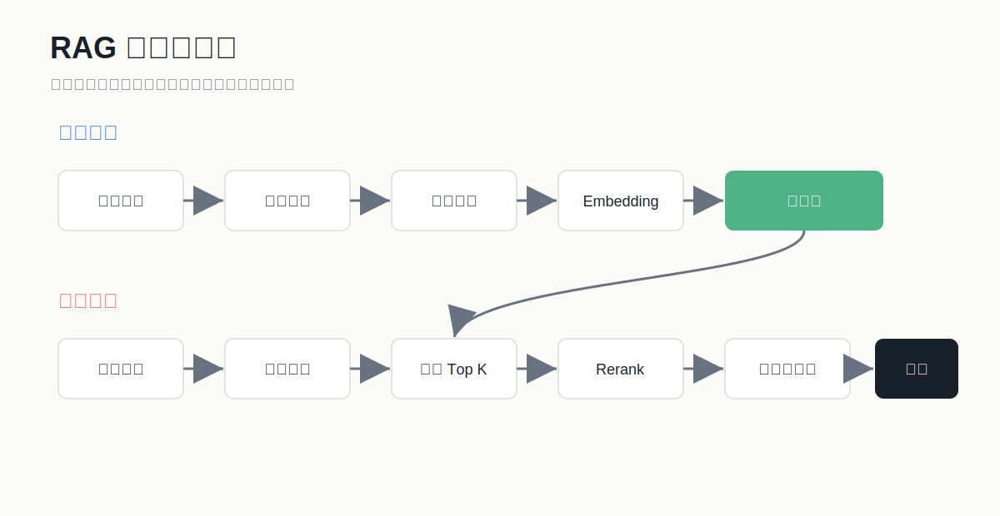
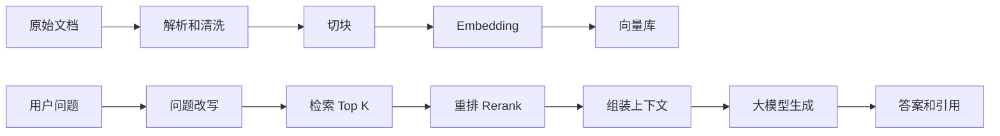

# RAG 从入门到实战

## 1. RAG 解决什么问题

大模型本身有两个关键限制：

- 训练知识固定，不能自动知道你的最新资料。
- 一次上下文有限，不能把所有文档都塞进去。

RAG 的思路是：用户提问时，先从外部知识库找相关内容，再让模型基于这些内容回答。

## 2. RAG 基础流程





## 3. 文档解析

常见资料：

- PDF：合同、手册、报告。
- Word：方案、制度、 SOP。
- Excel：产品表、价格表、统计表。
- 网页：帮助中心、官网文章。
- Markdown：技术文档。

文档解析要注意：

- 页眉页脚会污染知识库。
- 表格不能简单按纯文本打散。
- 图片里的文字需要 OCR。
- 标题层级非常重要。
- 文档版本要记录。

建议给每个 chunk 保存 metadata：

```json
{
  "doc_id": "employee_handbook_2026",
  "title": "员工手册",
  "section": "请假制度",
  "page": 12,
  "version": "2026-06",
  "source_path": "docs/employee_handbook.pdf"
}
```

## 4. 切块策略

切块太大：

- 检索不精准。
- 上下文浪费。
- 模型容易抓不到重点。

切块太小：

- 丢失上下文。
- 回答容易断章取义。

常见策略：

- 按标题切：适合结构化文档。
- 按段落切：适合文章和制度。
- 固定长度切：简单，但可能切断语义。
- 滑动窗口：chunk 之间保留重叠。

初始建议：

- 中文 chunk：500-1000 字。
- overlap：80-150 字。
- 保留标题路径：如“员工手册 > 考勤 > 请假”。

## 5. Embedding 和向量库

Embedding 模型负责把文本变成向量。向量库负责存储和相似度搜索。

常见向量库：

- FAISS：本地轻量，适合实验。
- Chroma：入门友好，适合 Demo。
- Milvus：适合规模化向量检索。
- Qdrant：部署和过滤能力较好。
- pgvector：适合已经使用 PostgreSQL 的团队。
- Elasticsearch：适合混合关键词和向量检索。

选择原则：

- Demo 阶段：Chroma / FAISS。
- 企业已有 PostgreSQL：pgvector。
- 大规模生产：Milvus / Qdrant / Elasticsearch。

## 6. 检索策略

基础检索：

- 用户问题向量化。
- 在向量库找相似 chunk。
- 取 Top K。

常见优化：

- Query Rewrite：把口语问题改写成更适合检索的问题。
- Multi Query：生成多个检索问题，扩大召回。
- Hybrid Search：关键词 BM25 + 向量检索。
- Metadata Filter：按部门、权限、时间、文档类型过滤。
- Rerank：用重排模型重新排序候选片段。

## 7. RAG Prompt 模板

```text
你是一个严谨的知识库问答助手。

规则：
1. 只基于参考资料回答。
2. 如果参考资料无法回答，请说“根据现有资料无法确定”。
3. 回答要简洁、准确。
4. 每个关键结论后标注引用编号，如 [1]。

参考资料：
{context}

用户问题：
{question}

请输出：
1. 直接答案
2. 依据
3. 引用来源
```

## 8. RAG 评测指标

检索侧：

- 召回率：正确资料有没有被找出来。
- Precision@K：Top K 里有多少真的相关。
- MRR：正确资料排得够不够靠前。

生成侧：

- Faithfulness：答案是否忠于资料。
- Answer Relevance：答案是否回答了问题。
- Context Relevance：检索上下文是否相关。
- Citation Accuracy：引用是否真实支持答案。

业务侧：

- 用户满意度。
- 人工转接率。
- 平均处理时长。
- 成本/次。
- 延迟。

## 9. RAG 常见问题定位

问题：回答胡说。

- 检查 Prompt 是否允许不知道。
- 检查检索结果是否相关。
- 检查是否塞入了互相矛盾的文档。

问题：答案找不到关键条款。

- 检查 chunk 是否切断标题和正文。
- 增加 Top K。
- 使用混合检索。
- 增加 rerank。

问题：回答很泛。

- 检查上下文是否太长太杂。
- 降低 Top K。
- 增加“必须引用具体条款”的要求。

问题：同义词问法搜不到。

- 使用 query rewrite。
- 加入同义词词典。
- 使用更合适的 embedding 模型。

## 10. 最小 RAG 项目清单

第 1 天：

- 准备 10 份文档。
- 人工整理 30 个问题。

第 2 天：

- 完成文档解析和切块。
- 存入向量库。

第 3 天：

- 完成检索和生成。
- 回答带引用。

第 4 天：

- 做 30 条问题评测。
- 分类错误原因。

第 5 天：

- 优化切块、Prompt、Top K、Rerank。
- 形成第一版 Demo。
