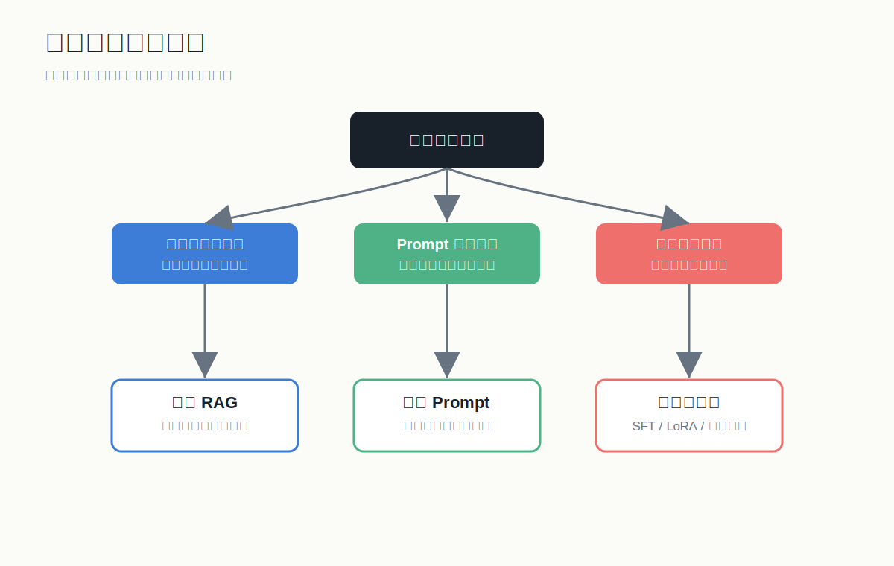
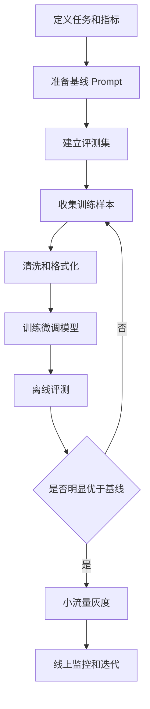

# 模型微调入门

## 1. 先说结论



微调不是大模型应用的第一选择。大多数应用应该先尝试：

1. 更好的 Prompt。
2. 更好的 RAG。
3. 更好的工具调用。
4. 更好的评测和数据清洗。
5. 最后再考虑微调。

## 2. 微调适合解决什么

适合：

- 输出风格长期固定。
- 任务格式高度稳定。
- 分类、抽取、路由边界明确。
- 你有大量高质量样本。
- 原模型已经基本会做，只是不够稳定。

不适合：

- 给模型灌最新知识。
- 让模型记住公司制度全文。
- 解决权限问题。
- 弥补混乱需求。
- 用少量低质量数据强行训练。

一句话：

> RAG 负责知识，微调负责行为。

## 3. 常见微调方式

### 3.1 SFT

Supervised Fine-Tuning，监督微调。给模型看大量“输入 -> 理想输出”的样本，让它学习任务模式。

样本示例：

```json
{
  "messages": [
    {"role": "system", "content": "你是客服助手。"},
    {"role": "user", "content": "我的快递三天没动了"},
    {"role": "assistant", "content": "很抱歉给您带来不便。请提供订单号，我帮您查询物流状态。"}
  ]
}
```

### 3.2 LoRA

LoRA 是参数高效微调方法。它冻结原模型大部分参数，只训练少量低秩适配器参数。

优点：

- 训练成本低。
- 显存要求低。
- 可以为多个任务保存多个 adapter。
- 适合开源模型微调。

### 3.3 QLoRA

QLoRA 是在量化模型上做 LoRA，进一步降低显存需求。适合资源有限时微调较大的开源模型。

### 3.4 DPO / 偏好优化

当你有“哪个回答更好”的偏好数据时，可以做偏好优化。它适合改善回答偏好、风格、拒答边界等，但比 SFT 更进阶。

## 4. 数据集设计

高质量微调数据比训练参数更重要。

每条数据要满足：

- 输入真实。
- 输出是你真想上线的答案。
- 格式统一。
- 覆盖常见场景。
- 包含难例和边界例。
- 没有错误示范。

数据规模建议：

- Prompt 优化：20-100 条样本就能开始。
- 小型 SFT 验证：200-500 条高质量样本。
- 较稳定任务：1000-5000 条。
- 复杂产品级任务：持续积累和迭代。

## 5. 数据清洗清单

- 删除重复样本。
- 删除错误答案。
- 删除过时政策。
- 删除泄露隐私的信息。
- 统一语气。
- 统一字段。
- 检查是否有模型不该承诺的内容。
- 平衡不同类别和场景。

## 6. 微调实验流程



## 7. 训练前必须有基线

微调前至少要有三个对照组：

- 原模型 + 简单 Prompt。
- 原模型 + 优化 Prompt。
- 原模型 + RAG 或工具调用。

否则你不知道微调是否真的带来收益。

## 8. 评测方式

离线评测：

- 固定测试集。
- 人工评分。
- LLM-as-judge 辅助评分。
- 分类任务可用准确率、F1。
- 生成任务可用人工 rubric。

线上评测：

- 用户满意度。
- 重新提问率。
- 人工接管率。
- 投诉率。
- 平均响应时间。
- 单次成本。

## 9. 常见失败原因

- 数据太少。
- 数据质量差。
- 训练集和评测集泄漏。
- 任务定义不清。
- 想用微调记知识。
- 忽略系统 Prompt。
- 只看训练 loss，不看真实业务指标。

## 10. 微调决策表

| 问题 | 优先方案 |
|---|---|
| 模型不知道公司制度 | RAG |
| 输出格式偶尔错 | Prompt + 结构化输出 + 重试 |
| 语气不符合品牌 | Prompt，必要时微调 |
| 分类边界不稳定 | 微调可考虑 |
| 文档经常更新 | RAG |
| 需要调用订单系统 | 工具调用 |
| 回答需要引用来源 | RAG |
| 大量同类客服话术 | 微调可考虑 |
