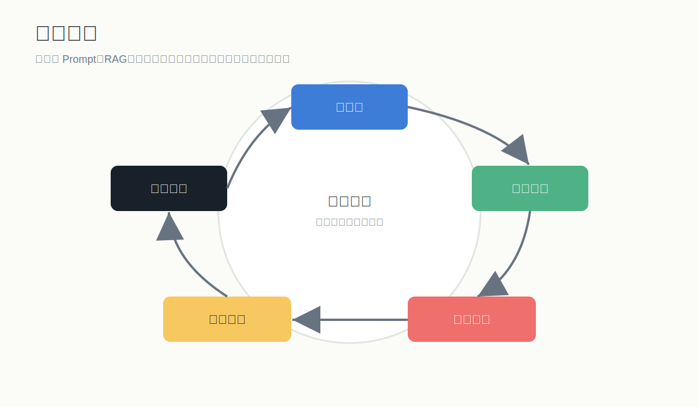

# 评测、监控与上线

## 1. 为什么评测比模型选择更重要

没有评测，大模型应用调优就是凭感觉。

你需要回答：

- 现在版本正确率是多少？
- 这次 Prompt 修改有没有变好？
- RAG 检索失败占多少？
- 哪些问题最容易幻觉？
- 成本和延迟是否能接受？

## 2. 评测集怎么建

评测集至少包含：

- 高频真实问题。
- 边界问题。
- 模糊问题。
- 恶意或越权问题。
- 查不到答案的问题。
- 多轮问题。
- 需要引用来源的问题。

字段建议：

| 字段 | 说明 |
|---|---|
| id | 问题编号 |
| question | 用户问题 |
| expected_answer | 标准答案 |
| source | 标准资料来源 |
| category | 问题类型 |
| difficulty | simple / medium / hard |
| must_refuse | 是否必须拒答 |
| notes | 备注 |

## 3. 评分 Rubric

每条回答按 1-5 分评分：

5 分：

- 完全回答问题。
- 事实准确。
- 引用正确。
- 格式符合要求。

3 分：

- 大体正确。
- 有轻微遗漏。
- 没有严重幻觉。

1 分：

- 答非所问。
- 编造事实。
- 引用不能支撑结论。
- 违反安全要求。

## 4. RAG 错误分类

每次错误都要归类：

- 文档缺失。
- 文档解析错误。
- 切块不合理。
- 检索没召回。
- 召回了但排序靠后。
- 召回了但模型没用。
- Prompt 约束不足。
- 用户问题本身不清楚。
- 权限过滤错误。

只有分类之后，才知道该改哪里。

## 5. 上线前检查

质量：

- 核心评测集通过。
- 无答案问题能拒答。
- 引用来源准确。
- 多轮对话不会丢失关键上下文。

安全：

- 用户只能访问自己有权限的数据。
- Prompt 注入不能绕过规则。
- 敏感信息不会被泄露。
- 日志不保存不必要隐私。

工程：

- API 超时重试。
- 模型返回格式校验。
- 降级方案。
- 成本预算。
- 监控告警。

## 6. 线上监控指标

业务指标：

- 日活用户。
- 留存率。
- 完成任务数。
- 人工接管率。
- 用户满意度。

模型指标：

- 平均输入 token。
- 平均输出 token。
- 平均延迟。
- 错误率。
- JSON 解析失败率。
- 拒答率。

RAG 指标：

- 检索耗时。
- Top K 命中率。
- 空检索率。
- 引用点击率。

成本指标：

- 单次会话成本。
- 单用户日成本。
- 缓存命中率。
- 高成本请求占比。

## 7. 成本优化

优先级：

1. 减少无关上下文。
2. 使用更便宜模型处理简单任务。
3. 对重复问题做缓存。
4. 对长文档做预摘要。
5. 使用路由：简单问题小模型，复杂问题大模型。
6. 限制最大输出长度。
7. 批处理离线任务。

## 8. 灰度上线

推荐节奏：

- 内部测试：10-20 人。
- 小范围真实用户：5%-10%。
- 扩大到 30%。
- 全量上线。

每个阶段都看：

- 错误样例。
- 用户反馈。
- 成本。
- 延迟。
- 安全问题。

## 9. 日志设计

建议记录：

- user_id 的匿名标识。
- question。
- prompt_version。
- model。
- retrieved_chunks。
- answer。
- latency。
- token_usage。
- user_feedback。
- error_type。

注意：

- 隐私字段要脱敏。
- 不要把密钥、身份证、手机号等敏感信息明文进日志。
- 数据留存周期要明确。
