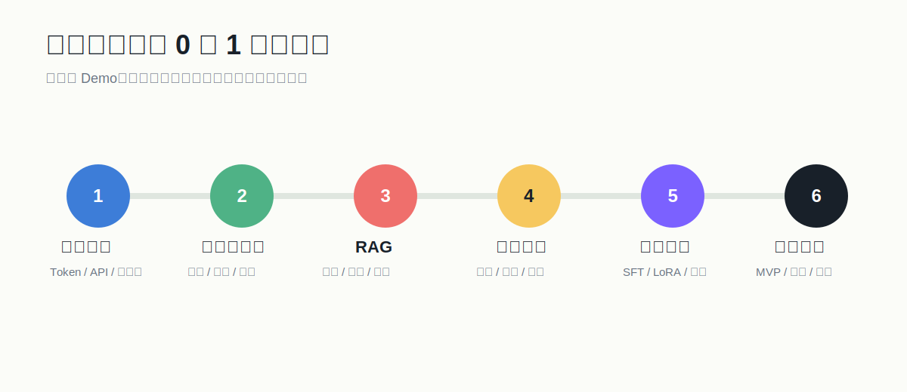
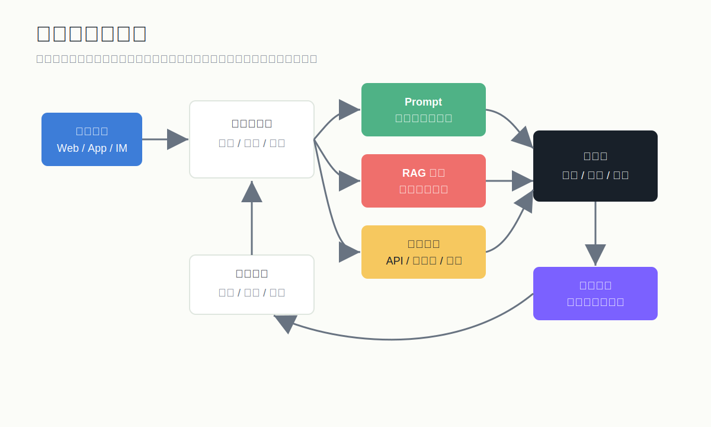

# 大模型应用从 0 到 1 学习资料库

这套资料面向“想从零开始做出可落地大模型应用”的学习者，重点不是追热点名词，而是建立一条能反复复用的方法线：

1. 先理解大模型能做什么、不能做什么。
2. 学会用 API 和提示词把模型调起来。
3. 用 RAG 连接企业/个人知识库。
4. 用评测体系判断效果，而不是凭感觉。
5. 再决定是否需要微调。
6. 最后把应用上线，控制成本、质量和风险。

## 推荐阅读顺序

1. [从0到1学习路径](./从0到1学习路径.md)
2. [01_基础认知/大模型应用基础.md](./01_基础认知/大模型应用基础.md)
3. [02_提示词工程/提示词工程实战.md](./02_提示词工程/提示词工程实战.md)
4. [03_RAG知识库/RAG从入门到实战.md](./03_RAG知识库/RAG从入门到实战.md)
5. [05_评测与上线/评测监控与上线.md](./05_评测与上线/评测监控与上线.md)
6. [04_微调与模型训练/模型微调入门.md](./04_微调与模型训练/模型微调入门.md)
7. [07_Agent与工具调用/Agent与工具调用入门.md](./07_Agent与工具调用/Agent与工具调用入门.md)
8. [06_项目实战/三个从0到1项目.md](./06_项目实战/三个从0到1项目.md)
9. [08_商业落地/AI创业落地路线.md](./08_商业落地/AI创业落地路线.md)
10. [resources/官方资料索引.md](./resources/官方资料索引.md)

## 图解总览

## 你最终应该具备的能力

- 能判断一个需求适合用提示词、RAG、微调、Agent，还是传统程序。
- 能设计一个最小可用的大模型应用。
- 能搭建基础 RAG：文档解析、切块、向量化、检索、重排、生成、引用。
- 能写出稳定的系统提示词和任务提示词。
- 能做离线评测和线上监控。
- 能判断微调的适用边界，知道“微调不是给模型灌知识”。
- 能为 AI 创业项目估算成本、风险和 MVP 路线。

## 资料结构

- `01_基础认知`：大模型、Token、上下文、Embedding、工具调用、应用架构。
- `02_提示词工程`：提示词结构、少样本、格式约束、反幻觉、Prompt 模板。
- `03_RAG知识库`：RAG 全流程、文档处理、向量库、检索优化、引用答案。
- `04_微调与模型训练`：SFT、LoRA、QLoRA、数据集、训练与验收。
- `05_评测与上线`：评测集、指标、A/B、日志、成本、灰度上线。
- `06_项目实战`：知识库问答、客服助手、行业报告助手。
- `07_Agent与工具调用`：工具调用、函数调用、Agent 边界、工作流编排。
- `08_商业落地`：AI 创业选题、MVP、定价、交付和数据闭环。
- `templates`：可直接套用的需求分析、Prompt、RAG 设计、评测表。
- `resources`：官方资料、学习资源、术语表。

## 学习建议

- 每学一个概念，都问一句：它解决什么问题，代价是什么？
- 每周至少做一个小 Demo，不要只收藏资料。
- 先做“能跑通”，再做“更准确”，最后做“可上线”。
- 提示词、RAG、微调三者不是替代关系，而是递进工具箱。
