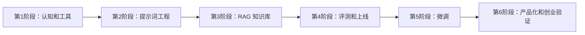

# 从 0 到 1 学习路径

## 总体路线图

## 第 1 阶段：入门认知，3-5 天

目标：听得懂大模型应用开发里的基本词。

必学内容：

- 大模型是什么：预测下一个 token 的通用模型。
- Token 是什么：模型处理文本的基本单位。
- 上下文窗口：模型一次能看到的内容长度。
- Temperature、Top P：控制生成随机性。
- Embedding：把文本变成向量，用来做相似度搜索。
- API 调用：把模型能力接进你的程序。
- 多模态：文本、图片、语音、视频输入输出。

练习：

- 用任意大模型工具完成 10 个任务：总结、改写、分类、提取、翻译、生成表格、写代码、解释代码、写计划、问答。
- 记录每个任务的输入、输出、失败点。

验收标准：

- 能解释“为什么模型会幻觉”。
- 能说明“RAG 和微调有什么区别”。
- 能说清楚“上下文窗口不是长期记忆”。

## 第 2 阶段：提示词工程，5-7 天

目标：把“随便问”变成“稳定生产结果”。

必学内容：

- 角色、目标、上下文、约束、输出格式。
- 零样本、少样本、多样本提示。
- 结构化输出：JSON、Markdown 表格、字段抽取。
- 分步骤任务拆解。
- 反幻觉：允许不知道、要求引用、限定资料来源。
- Prompt 版本管理。

练习：

- 写一个“销售话术生成 Prompt”。
- 写一个“合同条款风险提取 Prompt”。
- 写一个“公众号文章改写 Prompt”。
- 每个 Prompt 至少测试 20 条输入。

验收标准：

- 输出格式稳定率达到 90% 以上。
- 失败时能判断是指令不清、上下文不足，还是模型能力不够。

## 第 3 阶段：RAG 知识库，10-14 天

目标：做出一个能基于私有资料回答问题的知识库助手。

必学内容：

- 文档加载：PDF、Word、网页、Markdown、表格。
- 文档清洗：去页眉页脚、去重复、保留标题层级。
- 切块策略：按标题、段落、长度、语义切块。
- 向量化：Embedding 模型和向量维度。
- 向量库：FAISS、Chroma、Milvus、Qdrant、pgvector、Elasticsearch。
- 检索：Top K、相似度阈值、混合检索、查询改写。
- 重排：Rerank 提高上下文质量。
- 生成：把检索结果放进 Prompt，让模型回答并引用来源。

练习：

- 用 10 篇公司文档做一个问答助手。
- 每个回答必须带引用来源。
- 准备 50 个问题，记录命中率、正确率、幻觉率。

验收标准：

- 简单事实问题正确率超过 85%。
- 回答能指出来自哪份文档、哪一段。
- 查不到时能说“不确定”，而不是编答案。

## 第 4 阶段：评测和上线，7-10 天

目标：从 Demo 走向能给别人用。

必学内容：

- 评测集：真实问题、标准答案、难例、边界问题。
- RAG 指标：检索命中率、上下文相关性、忠实度、答案相关性。
- 线上日志：用户问题、召回片段、模型回答、耗时、成本。
- 灰度发布：先给少数用户试用。
- 安全策略：敏感信息、越权访问、提示词注入。
- 成本优化：模型选择、缓存、批处理、上下文压缩。

练习：

- 建立一个 100 条问题的评测表。
- 每次修改 Prompt 或检索策略后跑一次评测。
- 做一个错误分类表。

验收标准：

- 能用数据说明“这次改动变好了还是变差了”。
- 能定位主要错误来自检索、生成、文档质量还是用户问题。

## 第 5 阶段：微调，10-21 天

目标：知道什么时候该微调，以及怎样做第一版 SFT/LoRA。

优先级判断：

- 先调 Prompt。
- Prompt 不够时，做 RAG。
- RAG 解决不了“稳定风格、固定格式、特定任务动作”时，再考虑微调。

适合微调：

- 固定风格写作。
- 固定格式抽取。
- 行业客服语气和响应策略。
- 特定分类、路由、打标签任务。
- 模型已经会，但表现不稳定的任务。

不适合微调：

- 让模型记住频繁变化的新知识。
- 替代数据库。
- 弥补脏数据。
- 解决权限控制。

练习：

- 收集 200-500 条高质量输入输出样本。
- 训练一个小型 LoRA 或使用托管平台做 SFT。
- 与原模型、Prompt 版本、RAG 版本做对比。

验收标准：

- 在固定评测集上优于原方案。
- 没有明显过拟合。
- 成本、延迟、维护复杂度可以接受。

## 第 6 阶段：产品化和创业验证，长期

目标：把技术能力转成可收费产品。

必学内容：

- 需求验证：谁痛、痛多深、愿不愿付费。
- MVP：只做一个高频强痛点。
- 数据闭环：用户反馈变成评测集和训练集。
- 工作流设计：大模型负责语言和推理，传统程序负责确定性流程。
- 合规：隐私、版权、数据来源、行业监管。

建议做的 3 个方向：

- 企业知识库问答。
- 行业内容生产助手。
- 客服/销售/运营流程自动化助手。

## 每日学习安排模板

- 20 分钟：读一节资料。
- 30 分钟：跟做一个小 Demo。
- 20 分钟：记录失败案例。
- 20 分钟：优化 Prompt 或参数。
- 10 分钟：写复盘：今天学会了什么，明天要验证什么。
